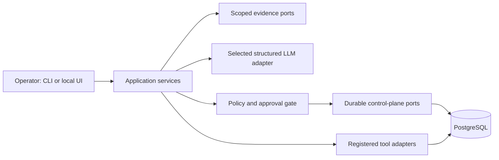

# Review the enterprise-agent design

This document explains how the harness turns noisy purchasing and quality evidence into controlled local work. It answers the assignment's questions about identity, authorization, memory, scaling, and deterministic workflow execution. The design favors a modular monolith with strong transactional boundaries over an autonomous agent or a distributed workflow platform.

## Architecture and trust boundaries

The application has four layers: presentation, application services, typed ports, and adapters. The command-line interface (CLI) and loopback user interface (UI) call application services. Those services own business policy and depend only on typed ports. PostgreSQL, seeded enterprise resource planning (ERP) records, mail, calendar, knowledge records, scheduler, audit ledger, and large language model (LLM) providers sit behind adapters.

The LLM sits before the gate, never behind it. It receives a narrow authorized context and may return only a schema-validated recommendation. It cannot decide authorization, issue an arbitrary tool call, select a workflow step, or write state. The gate recomputes eligibility and freshness from trusted context before a pending plan is stored.

This is a modular monolith by design. The assignment has one small data model, transactional approval and workflow requirements, and a single demonstration environment. Splitting detection, planning, approval, scheduling, and audit into services would introduce distributed transactions and operational work without improving the safety proof. The ports keep those boundaries extractable later.

## Identity and authorization

Every run starts by resolving an `ActorContext` from the identity port. It contains the actor's role, plant visibility, read and write scopes, backup approver, and currency-specific approval limits. Evidence providers accept this context as an input and apply scope, plant, recipient, and record filters in their database queries. The application does not fetch a broad result and filter it afterward.

That distinction matters in the scenarios. Dana can read purchasing, mail, calendar, and supplier-risk records for the seeded plant. Quinn can read quality records and write quality reallocations, but cannot query a purchase order, mailbox, calendar event, or supplier bulletin. Priya can receive production notifications but cannot create a purchase-order effect. An unknown actor fails closed.

Authorization is checked at more than one boundary:

| Boundary | Control |
|---|---|
| Evidence read | Scoped providers return only records the actor may see. |
| Recommendation validation | Typed schemas restrict outcome and parameter shapes. |
| Planning gate | Recomputes supplier eligibility, required scopes, price and currency limits, current evidence, and approval requirement. |
| Approval | Requires the assigned approver, current immutable plan hash, authority limit, and unexpired request. |
| Execution | Revalidates approval, actor scopes, declared tool contracts, and source versions before claiming work. |
| Tool adapter | Applies its own scope, input, freshness, and idempotency checks before changing the seeded external-style system. |

The local UI does not create a parallel bypass. Its form submits only an approval identifier and a signed, action-specific cross-site request forgery token. The server reloads the plan and invokes the same approval service used by the CLI.

## Planning and memory

The harness does not use conversational memory for business decisions. Its durable memory is explicit, versioned, and queryable:

| Memory type | Stored data | Purpose |
|---|---|---|
| Business evidence | Versioned suppliers, purchase orders, inventory, lots, allocations, messages, calendar events, and bulletins | Reconstructs the current authorized decision context. |
| Attention state | Cause, dedupe key, lifecycle, and source versions | Converts a repeated detector signal into one durable work item. |
| Plan and approval state | Typed intent, parameters, source versions, policy version, hash, approver, expiry, and decision | Binds human approval to the reviewed facts and exact intended effect. |
| Workflow and task state | Definition version, step state, attempts, idempotency keys, leases, and completion facts | Survives worker restarts and prevents duplicate effects. |
| Audit state | Chronological sanitized events, evidence references, policy facts, hash prefix, and failure category | Explains a run without rereading live business tables. |
| LLM metering | Provider, model, normalized token totals, cost, and cost source | Supports cost inspection without persisting prompts, outputs, or credentials. |

Mutable business inputs carry positive source versions. A plan binds the versions used to create it. A later change, such as a new on-schedule supplier update, a changed original purchase order, a released quality lot, or a superseding bulletin, causes approval or execution to stop rather than applying a stale recommendation.

The audit ledger is append-only at the database level. A trigger rejects updates and deletes. Audit payload sanitization removes credentials, raw provider responses, and other unsafe fields. `audit explain` therefore reads only the ledger and can show how detection, evidence, gating, approval, effects, and follow-up occurred without trusting the current database state.

## Deterministic workflow engine

Scenario A demonstrates the strongest execution boundary. A valid recommendation can name only `po_reroute:v1`. That declaration contains exactly six ordered steps:

1. Confirm that the alternate supplier is approved
2. Confirm that the alternate lead time meets the production date
3. Create the replacement purchase order
4. Reduce or cancel the original purchase order
5. Notify production
6. Schedule the arrival check

The model cannot add, remove, reorder, or parameterize new steps. The executor resolves the declaration by exact name and version, claims one durable instance, rechecks the approved plan and source versions, then advances only the next declared step.

Each effect has a stable idempotency key. The implementation records `tool.started`, invokes the seeded external-style tool boundary, and records the result and workflow transition separately. If a process stops after replacement-PO creation but before the local transition commits, retry uses the same key and leaves exactly one replacement order. A terminal failure compensates in reverse order: it can cancel the replacement order, restore the original order state, correct a notification, and cancel the arrival task.

Scenario B and optional Scenario C reuse the control plane without giving the model a general executor. They use typed, registered bounded tool plans. Scenario B permits reallocate-and-notify, shortage escalation, or manual review. Scenario C permits manual review or one causally bound purchase-order hold plus production notification. The shared gate, approval records, executor, scheduler, and audit service still own all writes.

## Time, scheduling, and recovery

The one-row `demo_clock` replaces wall time in deterministic flows. It starts at a fixed instant and persists across adapters. This permits repeatable end-of-day approval routing and a scheduled Tuesday receipt check.

The scheduler persists task type, due time, immutable payload, status, attempt count, idempotency key, and lease. PostgreSQL claims due work with row locking and `SKIP LOCKED`, which permits multiple workers to claim different tasks without duplicate processing. Expired leases may be reclaimed after a worker stops. Completion succeeds only for a live lease.

Approval escalation is also data-driven. At end of day, an unanswered request routes to the designated backup only when the original approver is unavailable the following day. The Tuesday task reads receipt evidence: a full receipt resolves the original attention item, while partial or missing receipt evidence creates one causally distinct, source-version-bound follow-up.

## LLM provider design

OpenAI, Claude, and OpenRouter implement one provider-neutral contract. Each selected adapter sends only authorized evidence and requests structured output for the relevant typed schema. The contract normalizes success, malformed output, timeout, refusal, and provider failure. A provider failure becomes a safe planner outcome; there is no automatic cross-provider fallback.

The interactive setup flow stores one chosen profile and adapter-reviewed, account-visible model in the ignored local `.env` file. It uses hidden API-key input, owner-only permissions, and an optional metadata-only credential check. Runtime audit events retain provider, model, status, token counts, cost, and cost source. They do not retain keys, prompts, outputs, or raw provider payloads.

The manual evaluation pack is intentionally separate from application correctness tests. It sends fixed synthetic cases through one explicitly selected provider and writes no database, workflow, ERP, mail, or audit state. Deterministic fake-planner scenario tests remain the correctness authority. The application gate remains in force even if a model recommendation is poor.

## Scaling and production path

The current Compose deployment is a local proof environment, not a production topology. PostgreSQL is the source of truth for control-plane state. The schema includes query indexes for active attention, approvals, workflows, scheduled tasks, supplier and purchase-order lookups, evidence chronology, and audit runs. Uniqueness constraints cover attention deduplication, workflow step position, scheduled-task identity, and tool invocation keys.

For moderate production scale, run stateless application programming interface (API) and worker replicas against a managed PostgreSQL database. Retain PostgreSQL row-lock claims for workflow and task work. Put real ERP, mail, calendar, identity, and knowledge adapters behind the existing ports. Use an outbox or connector-owned idempotency store where a real external system cannot accept the harness key directly. Partition or archive the append-only audit ledger by time and preserve the evidence references needed for explanation.

At larger scale, separate workloads only when their ownership or throughput differs: detector ingestion, workflow workers, and audit analytics are natural candidates. Do not split the plan, approval, and workflow state across independent databases without a durable transaction or outbox design. Those records form one safety boundary and must preserve the hash, source-version, approval, and effect ordering guarantees.

## Trade-offs and intentional limits

The design deliberately chooses safety and explainability over agent autonomy. It omits arbitrary natural-language task execution, automatic purchase authorization, general email ingestion, broad enterprise resource planning coverage, and live-provider behavior in continuous integration. It also keeps the optional review UI loopback-only and server-rendered.

Those limits make the required behavior inspectable in an interview. A reviewer can trace a recommendation to current authorized evidence, inspect the exact human approval, reproduce a crash, and verify that a restart does not create a second effect. Production expansion should retain those properties rather than replace them with prompt-based policy or unbounded agent tools.
